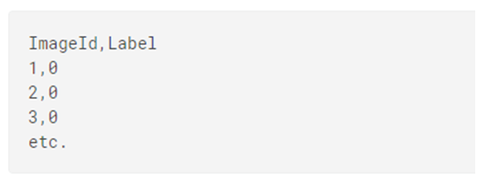
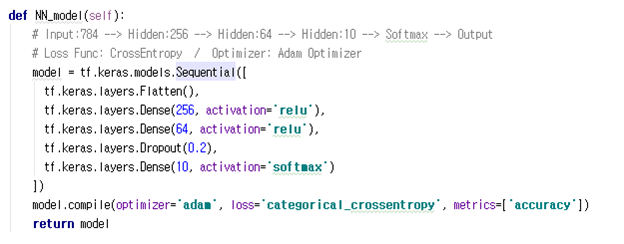
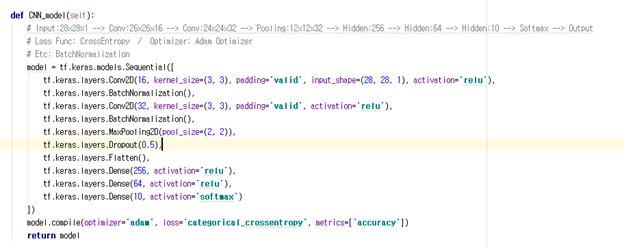
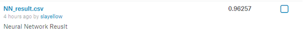
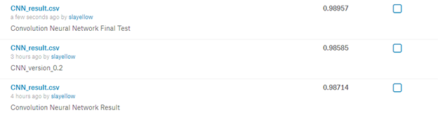

Digit-Recognizer
================

-	Site: https://www.kaggle.com/c/digit-recognizer

Description
-----------

-	MNIST는 컴퓨터 비전에서 'hello world'와 같다
-	MNIST 데이터셋을 통해서 0~9의 10개의 라벨을 분류하는 모델을 설계

Goal
----

-	테스트 데이터 셋으로 정답을 예측하여 정확도를 평가

Submission File Format
----------------------

Dataset
-------

-	Train 데이터 셋과 Test 데이터 셋으로 구성
	-	Train: 정답을 나타내는 라벨과 784개의 픽셀로 구성되어 있으며, 이는 28x28 사이즈를 나타냄
	-	785개의 Column으로 구성되고 총 42,000개로 구성
	-	Test: 정답을 나타내는 라벨 포함X
	-	784개의 Column으로 구성되고 총 28,000개로 구성

Model
-----

### Deep Neural Network

-	총 5개의 레이어로 구성

### Convolutional Neural Network

-	2개의 convolution layer, 3개의 fully connected layer 구성
-	convolution 뒤에 Batch Normalization 진행

Result
------

### Hyper Parameter

-	Epoch: 30
-	Batch_size: 1000

### Deep Neural Network

### Convolutional Neural Network

Discussion
----------

-	DNN으로는 96.2%의 정확도를 보여줌
-	CNN을 추가하였을 때 98.9%의 정확도를 보여주며 기존 DNN보다 2.7%의 성능 향상을 보임
-	CNN Layer에 대해 보완을 좀 더 하거나, 새로운 알고리즘을 사용하여 모델을 설계하면 좀 더 좋은 성능이 나올 수 있을 것 같다.
